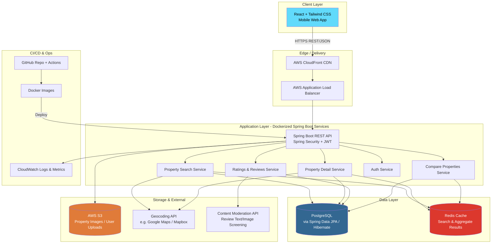
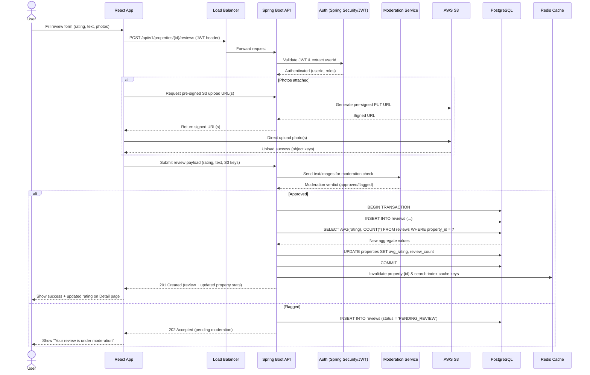
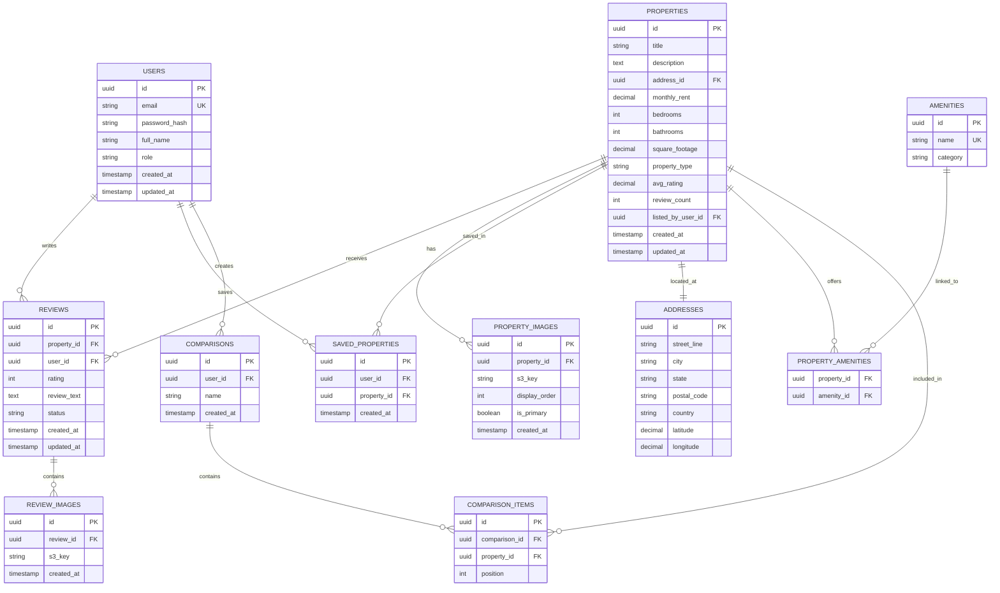

# RateMyRental — System Architecture

**Version:** 1.0
**Last Updated:** 2026-07-30
**Owner:** Engineering Team

---

## 1. Overview

RateMyRental is a mobile-first platform that allows tenants to search for rental properties, view detailed listings, read and submit ratings/reviews, and compare multiple properties side-by-side. This document describes the system's high-level architecture, technology justifications, critical data flows, database schema, and infrastructure/hosting strategy.

---

## 2. High-Level System Design

The system follows a **layered client-server architecture** with a React SPA (mobile-optimized) communicating with a Spring Boot REST API backend, backed by PostgreSQL for relational data and AWS S3 for media storage.

**Key architectural decisions:**
- **Stateless API tier**: JWT-based auth means any API instance can handle any request — enables horizontal scaling behind the ALB with no session affinity required.
- **Cache-aside pattern**: Redis sits in front of PostgreSQL for expensive read paths (search results, aggregate rating computations, comparison payloads) to reduce DB load and latency.
- **Media offloaded to S3**: The application servers never store binary files; images are uploaded directly (via pre-signed URLs) or proxied to S3, keeping API containers stateless and lightweight.
- **External APIs isolated behind service boundaries**: Geocoding and content moderation are called from dedicated service classes so they can be swapped, mocked, or circuit-broken independently.

---

## 3. Tech Stack & Justification

| Layer | Technology | Justification |
|---|---|---|
| **Language/Runtime** | Java 21 | LTS release with virtual threads (Project Loom), pattern matching for switch, and record patterns — improves I/O-bound throughput (critical for a read-heavy search app) and reduces boilerplate in DTOs/entities. |
| **Framework** | Spring Boot | Industry-standard, batteries-included framework with mature ecosystem (Security, Data, Actuator) — minimizes boilerplate wiring and accelerates delivery of REST APIs. |
| **Security** | Spring Security + JWT | Stateless, standards-based auth suited to a mobile client that can't rely on server-side sessions. JWT allows the API tier to scale horizontally without sticky sessions or a shared session store. |
| **Persistence** | Spring Data JPA + Hibernate | Reduces repetitive CRUD/query code via repository abstractions while still allowing native/JPQL queries for complex search and aggregation logic (e.g., average rating rollups). |
| **Database** | PostgreSQL | Strong relational integrity (foreign keys between properties, reviews, users), native support for JSONB (flexible amenity/attribute storage), full-text search (`tsvector`), and geospatial extensions (PostGIS) for location-based search. |
| **Migrations** | Flyway | Version-controlled, repeatable schema migrations checked into GitHub — ensures every environment (local, staging, prod) has an identical, auditable schema history. |
| **Build Tool** | Maven | Deterministic dependency management and lifecycle, well-integrated with Spring Boot starters and CI pipelines. |
| **API Documentation** | Swagger / OpenAPI | Auto-generates interactive API docs directly from annotated controllers — critical for a decoupled React frontend team to develop against a stable contract without backend detail knowledge. |
| **Frontend** | React | Component-based architecture suits a data-heavy UI (search filters, detail pages, comparison tables) with reusable cards/widgets; huge ecosystem for mobile-responsive patterns. |
| **Styling** | Tailwind CSS | Utility-first CSS enables rapid, consistent, mobile-first responsive design without maintaining large custom stylesheets — pairs well with component-driven React development. |
| **Object Storage** | AWS S3 | Durable, cost-effective storage for property images and user-uploaded review photos, decoupled from application servers; supports pre-signed URLs for direct client uploads. |
| **Containerization** | Docker | Consistent runtime across local dev, CI, and production; simplifies horizontal scaling and deployment to any container orchestrator (ECS/EKS/Fargate). |
| **Version Control / CI** | GitHub (+ Actions) | Central source of truth with PR-based review workflows; GitHub Actions builds/tests/pushes Docker images on every merge. |

---

## 4. Data Flow — Most Complex Feature: Submitting a Review & Rating Aggregation

The **Ratings & Reviews** feature is the most complex flow in the system because it touches authentication, file upload (S3), content moderation, transactional writes, and asynchronous aggregate recalculation that feeds both the Property Detail page and Search ranking.

**Why this is the most complex flow:**
1. It spans **three external/internal systems** (S3, Moderation API, PostgreSQL) in a single logical operation.
2. It requires a **transactional aggregate update** (average rating + count) that must stay consistent with the review write to avoid race conditions when multiple reviews are submitted concurrently.
3. It has a **cache invalidation side-effect** that ripples into both the Property Detail page and the Search/Compare features, which read cached aggregate data.
4. It involves **conditional branching** based on moderation outcome, affecting both the DB write path and the user-facing response.

---

## 5. Database Schema (ERD)

**Schema notes:**
- `properties.avg_rating` and `properties.review_count` are **denormalized aggregate columns**, intentionally duplicated from `REVIEWS` to make Search and Compare queries fast (avoiding `GROUP BY` joins on every listing page load). These are recalculated transactionally on every review write (see Section 4).
- `REVIEWS.status` supports values such as `APPROVED`, `PENDING_REVIEW`, `REJECTED` to support the moderation workflow.
- `ADDRESSES.latitude` / `longitude` support geospatial search (with a PostGIS extension or a simple bounding-box query as a v1 approach).
- All Flyway migrations live under `src/main/resources/db/migration` following the `V{n}__description.sql` naming convention.

---

## 6. Infrastructure — Hosting & Scaling

### 6.1 Hosting Topology

| Component | Service | Notes |
|---|---|---|
| Frontend (React build) | AWS S3 (static hosting) + CloudFront CDN | Static assets served globally with edge caching; SPA routing handled via CloudFront error-page fallback to `index.html`. |
| Backend API | AWS ECS Fargate (Docker containers) behind an Application Load Balancer | Serverless container hosting removes EC2 patching/management overhead; ALB handles TLS termination and path-based routing. |
| Database | AWS RDS for PostgreSQL (Multi-AZ) | Managed backups, automated failover, and read replicas for reporting/search-heavy read traffic. |
| Cache | AWS ElastiCache for Redis | Sub-millisecond reads for search results, property aggregates, and comparison payloads. |
| Object Storage | AWS S3 | Property and review images; lifecycle policies transition old/unused images to S3 Infrequent Access. |
| Secrets | AWS Secrets Manager | DB credentials, JWT signing keys, third-party API keys — injected into ECS tasks at runtime, never baked into images. |
| CI/CD | GitHub Actions → Amazon ECR → ECS | On merge to `main`: build & test → build Docker image → push to ECR → trigger ECS rolling deployment. |
| Observability | Amazon CloudWatch (Logs, Metrics, Alarms) + AWS X-Ray | Centralized logs from all containers; alarms on error rate, latency, and DB connection saturation. |

### 6.2 Scaling Strategy

- **Horizontal scaling (API tier)**: ECS Service Auto Scaling adjusts task count based on ALB request count per target and CPU/memory utilization. Because the API is stateless (JWT auth, no server-side sessions), tasks can be added/removed freely.
- **Database scaling**: Start with a single Multi-AZ RDS instance; introduce **read replicas** for Property Search and Compare queries once read traffic grows, keeping writes (reviews, listings) on the primary.
- **Caching to reduce DB pressure**: Search result pages and property aggregate stats are cached in Redis with short TTLs (e.g., 60–300s) plus explicit invalidation on writes (see Section 4), reducing repeated load on Postgres for popular listings.
- **CDN for static & media content**: CloudFront fronts both the React SPA bundle and (optionally) S3-hosted property images, reducing latency for mobile users and offloading traffic from origin.
- **Connection pooling**: HikariCP (bundled with Spring Boot) is tuned per-container to avoid exhausting RDS max connections as the ECS service scales out; consider RDS Proxy if task count grows significantly.
- **Blue/Green or Rolling Deployments**: ECS rolling deployments with health checks ensure zero-downtime releases; a blue/green strategy via CodeDeploy can be adopted later for safer production rollouts.

### 6.3 Environments

| Environment | Purpose | Notes |
|---|---|---|
| `local` | Developer machines | Docker Compose spins up API + Postgres + Redis locally; Flyway auto-migrates on startup. |
| `staging` | Pre-production validation | Mirrors production topology at smaller scale; used for QA and PR preview deployments. |
| `production` | Live traffic | Multi-AZ RDS, auto-scaled ECS service, CloudFront + WAF in front of public endpoints. |

---

## 7. Cross-Cutting Concerns

- **Security**: All traffic terminates TLS at the ALB/CloudFront; JWTs are short-lived with refresh tokens; Spring Security enforces role-based access (e.g., only property owners can respond to reviews).
- **API Documentation**: Every controller is annotated for Swagger/OpenAPI generation, published at `/swagger-ui.html`, giving the React team a live, always-current contract.
- **Auditability**: `created_at`/`updated_at` timestamps on all core tables; Flyway migration history provides a full audit trail of schema evolution.
- **Resilience**: External calls (Geocoding, Moderation) are wrapped with timeouts and circuit breakers (e.g., Resilience4j) so third-party outages degrade gracefully rather than failing the entire review/search flow.
